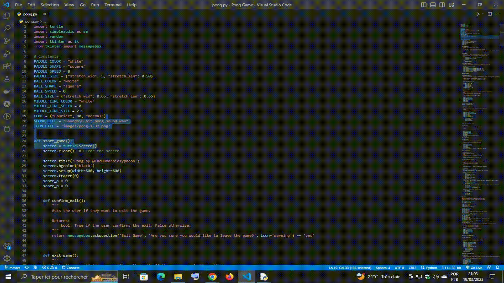

# Pong Game
A simple game of Pong implemented in Python using the Turtle and Pygame libraries.

## Preview

## Table of Contents
- Introduction
- Requirements
- Installation
- How to Play
- Contributing
- License
## Introduction
Pong is a classic arcade game that was first released in 1972. The game is played with two paddles and a ball, and the objective is to score points by hitting the ball past the opponent's paddle. This implementation of the game was written in Python and uses the Turtle and Pygame libraries.

## Requirements
- Python 3.x
- Pygame
- Turtle
- Tkinter library
## Installation
- Clone the repository. 
- Install the required dependencies by running the following command in your terminal: `pip install -r requirements.txt`.
- Run the `pong.py` file to start the game.
## How to Play
The game is played using the arrow keys and the `W` and `S` keys. The left paddle is controlled with the `W` and `S` keys, and the right paddle is controlled with the `Up` and `Down` arrow keys. The game can be paused by pressing the `Spacebar`, and the game can be exited at any time by pressing the `Esc` key.

## Contributing
Contributions are welcome! If you have any suggestions for improving the program or finding bugs, please submit an [issue](https://github.com/TheHumanoidTyphoon/python-turtle-pong-game/issues) or pull request on the [GitHub repository](https://github.com/TheHumanoidTyphoon/python-turtle-pong-game).

## Acknowledgments
This project was inspired by the classic Pong game.
The game sound effect was taken from the website [freesound.org](https://www.freesound.org/).
The Pong icon was taken from the website [icon-icons.com](https://www.icon-icons.com/).

## License
This project is licensed under the [MIT](https://github.com/TheHumanoidTyphoon/python-turtle-pong-game/blob/main/LICENSE) License
